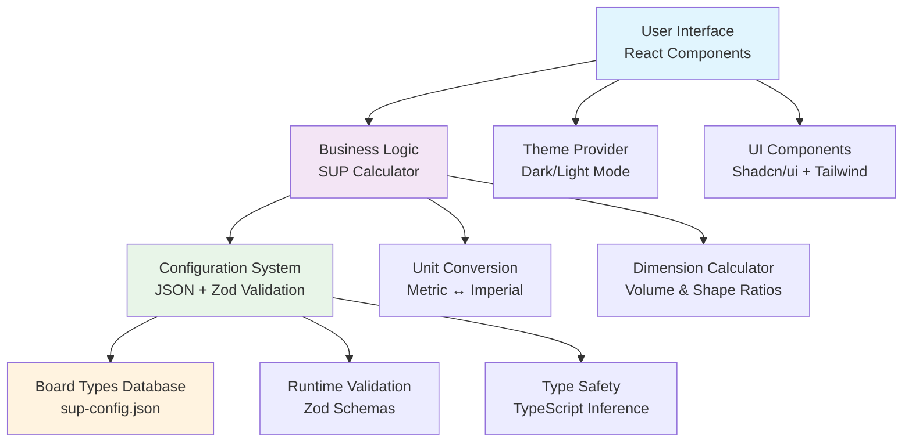
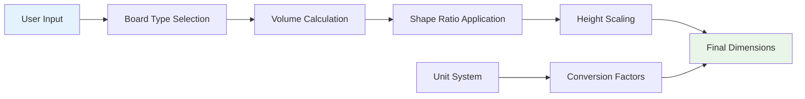

# 🏄‍♂️ SUP Finder

A modern, responsive web application that helps stand-up paddle (SUP) enthusiasts find their perfect board dimensions based on their physical characteristics and paddling style.

## ✨ Features

- **🎯 Intelligent Board Sizing**: Advanced algorithm calculates optimal SUP dimensions based on height, weight, and board type
- **📱 Mobile-First Design**: Touch-friendly sliders and preset buttons optimized for all devices
- **🌓 Dark/Light Theme**: Beautiful gradient backgrounds with seamless theme switching
- **🔄 Unit Conversion**: Switch between metric (cm, kg) and imperial (inches, lbs) systems
- **🏄‍♀️ 9 Board Types**: Comprehensive selection including all-around, touring, surf, yoga, fishing, racing, whitewater, and expedition
- **⚙️ JSON Configuration**: Easily maintainable configuration system with runtime validation
- **🎨 Modern UI**: Built with Shadcn/ui components and Tailwind CSS

## 🎮 Live Demo

Visit the app at `http://localhost:5174/` after running locally.

## ��️ Architecture



## 🔬 How It Works

The SUP Finder uses a sophisticated algorithm to calculate optimal board dimensions:

1. **Volume Calculation**: Based on user weight and board type-specific multipliers
2. **Shape Ratios**: Each board type has unique length/width/thickness ratios
3. **Height Scaling**: Adjusts dimensions based on user height for optimal performance
4. **Unit Conversion**: Seamless switching between metric and imperial systems

### Calculation Flow



## 🚀 Tech Stack

- **Frontend**: React 18 with TypeScript
- **Build Tool**: Vite for fast development and optimized builds
- **Styling**: Tailwind CSS with custom gradients
- **UI Components**: Shadcn/ui component library
- **Validation**: Zod for runtime type checking and schema validation
- **Theme**: Custom dark/light mode implementation
- **Icons**: Emoji-based iconography for universal compatibility

## 📁 Project Structure

```
sup-finder/
├── src/
│   ├── components/
│   │   ├── ui/              # Shadcn/ui components
│   │   ├── SupFinder.tsx    # Main application component
│   │   ├── theme-provider.tsx
│   │   └── mode-toggle.tsx
│   ├── config/
│   │   └── sup-config.json  # Board types and settings
│   ├── lib/
│   │   ├── config.ts        # Configuration loader with Zod
│   │   ├── supCalculator.ts # Core calculation engine
│   │   └── utils.ts         # Utility functions
│   ├── types.ts             # TypeScript type definitions
│   └── App.tsx              # Root component
├── components.json          # Shadcn/ui configuration
└── package.json
```

## ⚡ Quick Start

### Prerequisites

- Node.js 18+ installed
- npm or yarn package manager

### Installation

1. **Clone the repository**

   ```bash
   git clone <repository-url>
   cd sup-finder
   ```

2. **Install dependencies**

   ```bash
   npm install
   ```

3. **Start development server**

   ```bash
   npm run dev
   ```

4. **Open your browser**
   ```
   http://localhost:5174/
   ```

### Available Scripts

- `npm run dev` - Start development server with hot reload
- `npm run build` - Build for production
- `npm run preview` - Preview production build locally
- `npm run lint` - Run ESLint for code quality

## 🎯 Usage Guide

### Step 1: Select Your Board Type

Choose from 9 specialized board types:

- **All-Around**: Perfect for beginners and versatile use
- **Touring**: For long-distance paddling and exploration
- **Surf**: Designed for wave riding
- **Yoga**: Extra stable for fitness and yoga
- **Racing**: Narrow and fast for competitive paddling

### Step 2: Input Your Measurements

- Use the **sliders** for precise control
- Try **preset buttons** for quick selection (Short/Average/Tall, Light/Average/Heavy)
- **Switch units** between metric and imperial as needed

### Step 3: Get Your Results

The app calculates and displays:

- **Length**: Optimal board length for your specifications
- **Width**: Ideal width for stability and performance
- **Thickness**: Perfect thickness for buoyancy
- **Volume**: Total board volume in liters
- **Explanation**: Why these dimensions work for you

## ⚙️ Configuration

The app uses a JSON configuration system located in `src/config/sup-config.json`. This allows easy modification of:

- Board type specifications and multipliers
- Unit system ranges and presets
- Calculation parameters
- Conversion factors

All configuration is validated at runtime using Zod schemas for type safety.

## 🎨 Customization

### Adding New Board Types

1. Edit `src/config/sup-config.json`
2. Add your board type with required properties:
   ```json
   "your-board-type": {
     "name": "Your Board Type",
     "description": "Description here",
     "icon": "🏄",
     "volumeMultiplier": 1.2,
     "shapeRatio": {
       "length": 3.5,
       "width": 1.0,
       "thickness": 0.15
     }
   }
   ```

### Modifying UI Theme

The app uses Tailwind CSS with custom gradient backgrounds. Modify the gradients in `src/components/SupFinder.tsx`:

```tsx
className =
  'bg-gradient-to-br from-blue-50 via-cyan-50 to-teal-50 dark:from-slate-900 dark:via-blue-900 dark:to-teal-900';
```

## 🤝 Contributing

1. Fork the repository
2. Create a feature branch: `git checkout -b feature/amazing-feature`
3. Commit your changes: `git commit -m 'Add amazing feature'`
4. Push to the branch: `git push origin feature/amazing-feature`
5. Open a Pull Request

## 📄 License

This project is open source and available under the [MIT License](LICENSE).

## 🏄‍♀️ Built for the SUP Community

Made with 💙 by paddlers, for paddlers. Whether you're a beginner looking for your first board or an experienced paddler exploring new styles, SUP Finder helps you make informed decisions about your next board purchase.

---

**Happy Paddling!** 🌊
